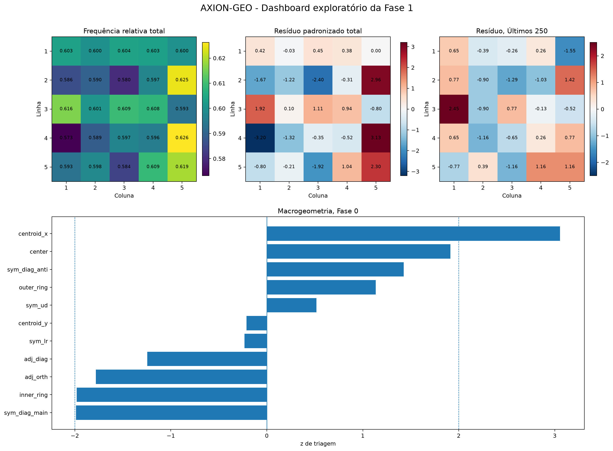
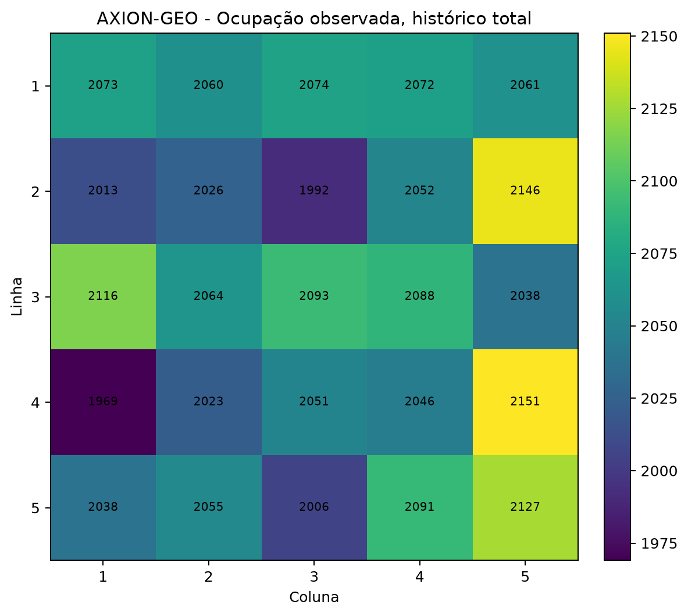
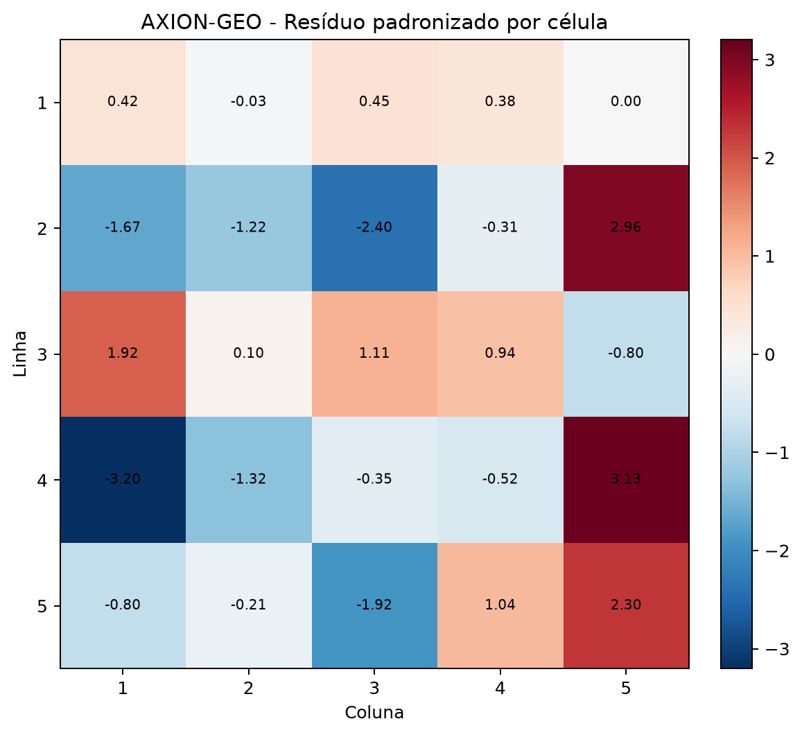
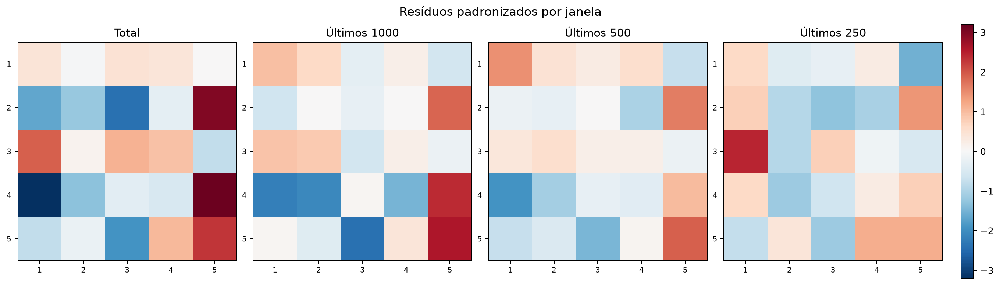
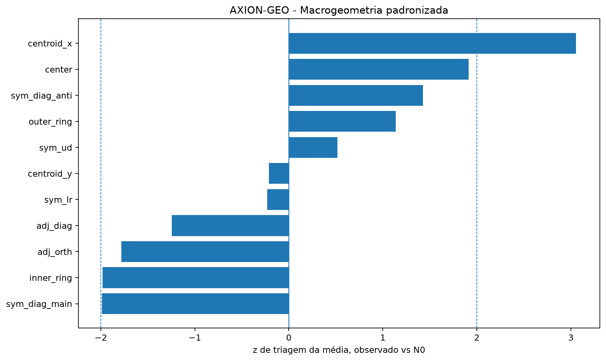

# AXION-GEO - Resultados visuais da Fase 1

**Status:** exploratório, sem uso preditivo  
**Base:** concursos 1 a 3435  
**Quantidade:** 3435 concursos  
**Nulo de referência:** seleção uniforme 15/25, expectativa marginal de 0,60 por célula

## Dashboard

## Heatmaps

| Observado | Resíduo N0 |
|---|---|
|  |  |

## Estabilidade temporal

## Macrogeometria

## Células com maior desvio absoluto no histórico total

| dezena | row | col | observed_rate | z_n0 |
|---|---|---|---|---|
| 16 | 4 | 1 | 0.5732 | -3.204 |
| 20 | 4 | 5 | 0.6262 | 3.135 |
| 10 | 2 | 5 | 0.6247 | 2.960 |
| 8 | 2 | 3 | 0.5799 | -2.403 |
| 25 | 5 | 5 | 0.6192 | 2.299 |

## Features geométricas com maior z absoluto na triagem da Fase 0

| feature | z_screen_mc | q_bh_screen_mc |
|---|---|---|
| centroid_x | 3.056 | 0.0601 |
| sym_diag_main | -1.988 | 0.2932 |
| inner_ring | -1.980 | 0.2932 |
| center | 1.913 | 0.2932 |
| adj_orth | -1.782 | 0.3196 |

## Leitura metodológica

Os mapas de resíduo comparam cada célula à expectativa N0 de 60%. Um desenho visualmente marcante não é suficiente para caracterizar estrutura morfológica. A interpretação exige persistência temporal e, na etapa seguinte, comparação com um nulo N1 que preserve as margens históricas por dezena.

A Fase 0 já mostrou que nenhuma das 47 features geométricas foi promovida após controle Benjamini-Hochberg. Portanto, estes gráficos são instrumentos de diagnóstico e formulação de hipóteses, não filtros para seleção de jogos.

## Arquivos

- [Metadados](visuals_metadata.json)
- [Resumo por célula](visuals_summary.csv)
- [Manifesto](visuals_manifest.md)

Autor: Jacson Cruz do Nascimento
